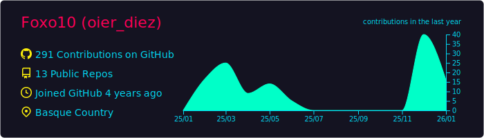
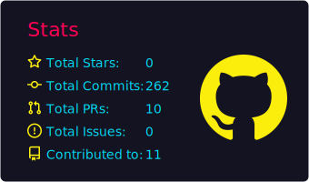
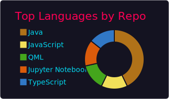
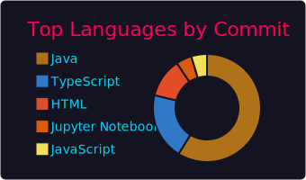
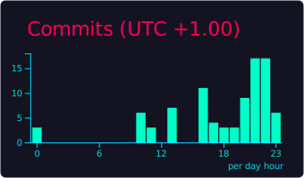

<!--
Perfil README de GitHub: https://github.com/Foxo10
-->

<h1 align="center">Kaixo 👋 Soy Oier (Foxo10)</h1>

  Estudiante de Ingeniería Informática (UPV/EHU) · Estudiante en 42 Urduliz · Basque Country · Dev web/móvil · Datos/IA · Linux & Docker
  

  
  

---

## 🚀 Sobre mí
- 🎓 4º de grado en **Ing. Informática de Gestión y SI** (UPV/EHU)
- 🏊‍♂️ Estudiante de **42 Urduliz** (Cursus)
- 📱 Me gusta construir **apps móviles**
- 🌐 También hago **web** (JS/TS) y trasteo con **backend** cuando toca
- 📊 Interés en **datos / IA** (Python + notebooks)
- 🐧 Fan de **Linux**, **Docker** y automatizar cosas

## 🔭 En qué estoy ahora
- 🏊‍♂️ **Cursus de 42 Urduliz** — recopilando apuntes, progreso y aprendizajes
- 📚 Terminando la carrera trabajando con el TFG
- ⚙️ Mejorando hábitos de dev: testing, clean code y automatizaciones pequeñas

## 🧰 Tech stack (lo que más uso)

  
  
  
  
  
  
  

## 📌 Proyectos destacados
- 🏊‍♂️ **42 Igerilekua** (mi experiencia en la Piscine): https://github.com/Foxo10/42-igerilekua
- 🖥️ **42 Cursus** (mi evolución durante el Cursus): https://github.com/Foxo10/42-cursus
- 🚗 **Unigo** (coche compartido / reservas): https://github.com/Foxo10/Unigo
- 🗺️ **Wikifont**: https://github.com/Foxo10/Wikifont

## 📈 GitHub stats

  

  
  

  
  

###
 

---

## 🤝 Contacto
- LinkedIn: https://www.linkedin.com/in/oier-d%C3%ADez-guti%C3%A9rrez-705a87347/
- GitHub: https://github.com/Foxo10
